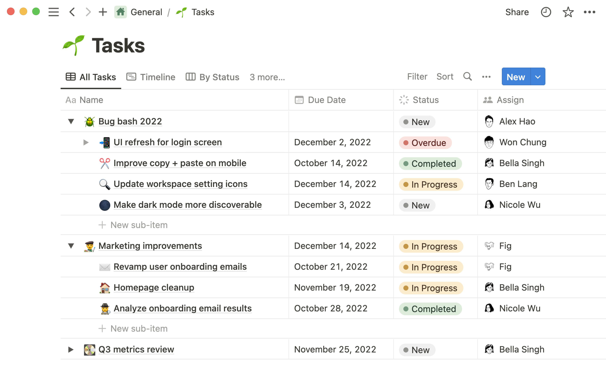

# **Prototype Time and Task Management Application** :calendar:

# The Design Process

### Reviewing the design of existing time management tools

Bullet Journaling

- Easier to learn how to use than digital systems
- Greater degree of freedom and creativity to decide how you want to plan your schedule or record tasks 
- Not as convenient as a digital system that you can access from various electronic devices
- Features can't be created instantly, must create the design/layout of everything by scratch 
- Workspace is limited to the pages of the journal

Calendar Apps (Google Calendar, Apple Calendar)

- Agenda views for flexible scheduling
- Can set up reminders and notifications
- Syncs with other Google services and devices
- Shared calendars can be used to collaborate with others and manage group events
- Has a search feature which allows keyword searches
- Can attach files and documents to calendar entries

Notion

- More intricate interface with lots of customization and features
- Can begin with blank canvas or download default templates
- App is split into sidebar (holds all task databases and pages) and editor
- Pages are empty for space to write, plan, brainstorm

### Interviewing college students

Student #1 :bust_in_silhouette:
- Has a hard time visualizing how much time a task actually takes which makes the task more intimidating to start
- Says that having a visual difference between different types of tasks like school tasks vs chores/errands helps a lot 
- Enjoys using tools that are easy to use and aesthetically pleasing 
- Says that it is satisfying to cross out tasks when they are completed (helps to see the progress you made with using your time productively) 
- Says that it is helpful to have layout that shows overview of short & long term projects
- Says that it is nice to have systems that breaks up large tasks into smaller ones
- Wants a system where other people can see your tasks and where you are in terms of progress

Student #2 :bust_in_silhouette:
- Writes tasks down on Google Calendar and checks academic tasks on Canvas calendar
- Thinks that a digital calendar is essential as a student
- Uses more than one tool since some are not automatically synchronized
- Doesn't use analog tools because they are hard to bring along
- Wants automatic syncing with Canvas and separate group calendar options 
- Is a procrastinator, often writes things down but ends up forgetting
- Would like reminder popups when tasks are reaching the deadline

Student #3 :bust_in_silhouette:
- Likes seeing daily, weekly, monthly views
- Prefers visual task management over lists, like time blocks in weeks
- Likes visually appealing, color coordination, can add photos and symbols → like the visual aspect of planning
- Thinks that Notion could offer more base templates, bad instruction on how to use it, takes a lot of effort to figure out how to use all the features
- Would like a main homepage/hub
- Likes clicking into tasks for more details, links to canvas, school dashboard
- Uses school academic calendar in paper planners → keep track of quarter system at the same time, but still prefer digital tools
- Does not have time to customize from the bottom up, prefer a simple layout that is already provided that can allow for a bit of customization

### Takeaways 

Students often find it difficult to keep everything organized. They are grateful for time management tools, especially those that can clearly distinguish between different types of tasks, such as academic assignments and daily errands. In addition, students have a preference for tools that combine user friendliness and attractive design.

A successful time management tool should provide a user-friendly interface, provide short - and long-term project views, help break down complex tasks, support task sharing to track progress, and ideally automatically sync with the academic calendar. An effective tool should provide daily, weekly, and monthly views, employ visual task management rather than plain text lists, provide color-coded visual customization, and intuitive features such as symbols. An effective time management app should be able to be used on a variety of devices, be easy to learn, support quick creation features, provide a spacious workspace, and most importantly, be able to estimate the time required for tasks and distinguish between task types through visual cues. In addition, it should support tagging completed tasks, display project timelines, support splitting large tasks, and allow sharing of tasks to track progress.

# Our Prototype Application

This is a task management application that are tailored to the specific needs of college students. This app will emphasize on visual time management and schedule sharing. It will focus on user-friendliness and synchronization across multiple devices to facilitate cross-platform use such as canvas. Key features will encompass a search function, visual customization options like themes and light/dark modes, as well as a help feature providing instructions on app usage. Our Breadcrumb navigation will enhance users' ability to navigate seamlessly between different sections.

### Application Functionality

Our application's functionality will be revolving around the main dashboard. The dashboard will provide a daily task overview and quick access to course-related information, such as course syllabi. A visual calendar will offer daily, weekly, and monthly views, allowing users to switch between compact or list views as needed. Users will be able to click on tasks to add detailed information, notes, or files, and assign different attributes to distinguish them by course, priority, or status. In the weekly view, the application will even use time blocks to visually represent events and tasks and indicate their time requirements. Larger projects can be further subdivided into sub-tasks, each with its dedicated page. The app will provide task page templates for efficient task creation. The sidebar will offer options to switch between different workspaces, including school and leisure. Users can overlay calendars with friends or maintain a fully shared calendar to coordinate social gatherings and activities.

### Information Architecture

The information structure of the application is designed to cater to users' primary needs and objectives, including straightforward navigation, reminders, time management, note-taking, and customization. Key features will comprise the dashboard, calendar, tasks, reminders, and a study timer. The inclusion of settings and customization sections, such as user profiles, calendar integration, and application preferences, will enhance structural consistency and flexibility.

### User Persona

Our target groups are tailored by viewing user personas and user journey, we focus on full-time college students who prioritize convenience, simplicity, and aesthetics. These students are visual learners who enjoy collaboration and sharing their schedules with others, they may also are seeking for efficient time management solution tailored to their busy student lives. They were drawn to the app due to its personalized features that are efficient, customizable user-friendly interface, and accessibility across different devices.

### User Journey

We predict the possible steps a user might take to accomplish their goals using our app might look like the following:

1. User looks for time management applications to better manage their busy student life
2. User finds our time management application on the app store because it is advertised to be specifically catered to college students 
3. User learns about the features our application offers and decides to try out our app 
4. User navigates to the main homepage where they learn how to create new tasks with the help of a short tutorial 
5. User navigates to the calendar page where they see all the tasks they have currently added
6. User navigates to the classes section to add the classes they are currently taking
7. User edits task details by customizing the colors the tasks are represented by
8. User turns on notifications which helps them remember to start their first task

