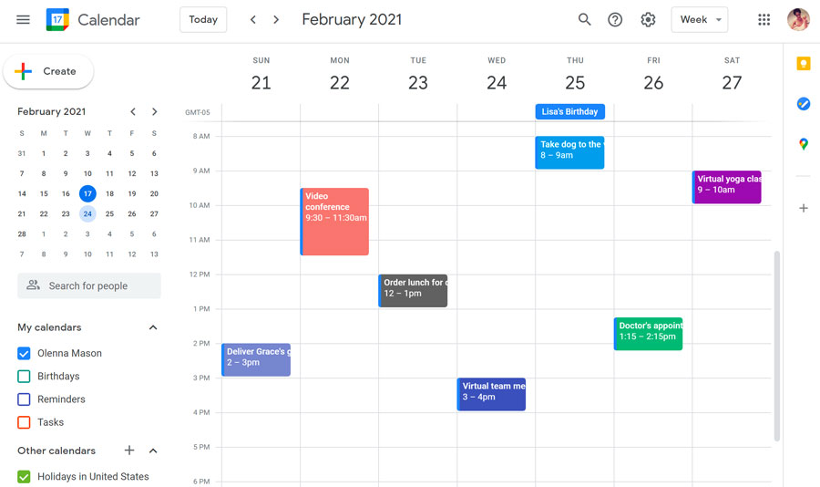

# **Prototype Time and Task Management Application** 

# The Design Process

### Reviewing the design of existing time management tools

**Bullet Journaling**

Bullet journaling is an analog task and time management tool that uses a journal and various stationery items. This highly customizable method combines writing and drawing so that users can create calendars, todo lists, and other plans within the pages of their journal. 

Pros:
- Knowledge of digital systems/technology is not needed (all you need is a journal and stationery to get started which makes it easier to learn how to use)
- Greater degree of freedom and creativity to decide how you want to plan your schedule or record tasks 
- Greater opportunities to manually draw out plans (good for people who enjoy being artistic or want more visualization) 

Cons:
- Not as convenient as a digital system that you can access from various electronic devices 
- Need to create the design/layout of everything by scratch - may be hard for those who aren’t creative or can’t draw
- May take more time to draw and write out everything in comparison to digital systems where most features can be created instantly
- Limited workspace - may be hard to fit everything within the pages of the journal

**Calendar Apps (Google Calendar, Apple Calendar)**

- Agenda views for flexible scheduling
- Can set up reminders and notifications
- Syncs with other Google services and devices
- Shared calendars can be used to collaborate with others and manage group events
- Has a search feature which allows keyword searches
- Can attach files and documents to calendar entries

**Notion**

Notion is a digital note-taking workspace that has many tools surrounding task management and project tracking. Pages can hold templates or be built from scratch to align to the user’s needs. 

Pros:
- Clean and visually appealing design
- Highly customizable with various features 
- Free templates with multiple use cases
- Lots of formatting options → timelines, calendars, lists, galleries, with ability to add properties to tasks and sort thouroughly
- Very collaborative, especially for project management as multiple people can edit and work in one workspace
- Allows for embedded media in pages like documents and images
- Multi-device synchronization

Cons:
- Learning curve when first figuring out how to implement and use different features → app is very technical
- Structure can be a bit overwhelming because there are so many capabilities

### Interviewing college students

**Student #1: Renee (Business Major, 4th year)**
- Has a hard time visualizing how much time a task actually takes which makes the task more intimidating to start
- Says that having a visual difference between different types of tasks like school tasks vs chores/errands helps a lot 
- Enjoys using tools that are easy to use and aesthetically pleasing 
- Says that it is satisfying to cross out tasks when they are completed (helps to see the progress you made with using your time productively) 
- Says that it is helpful to have layout that shows overview of short & long term projects
- Says that it is nice to have systems that breaks up large tasks into smaller ones
- Wants a system where other people can see your tasks and where you are in terms of progress

**Student #2**
- Writes tasks down on Google Calendar and checks academic tasks on Canvas calendar
- Thinks that a digital calendar is essential as a student
- Uses more than one tool since some are not automatically synchronized
- Doesn't use analog tools because they are hard to bring along
- Wants automatic syncing with Canvas and separate group calendar options 
- Is a procrastinator, often writes things down but ends up forgetting
- Would like reminder popups when tasks are reaching the deadline

**Student #3: Sarah (Human Bio & Society Major, 4th year)**
- Likes seeing daily, weekly, monthly views
- Prefers visual task management over lists, like time blocks in weeks
- Likes visually appealing, color coordination, can add photos and symbols → like the visual aspect of planning
- Thinks that Notion could offer more base templates, bad instruction on how to use it, takes a lot of effort to figure out how to use all the features
- Would like a main homepage/hub
- Likes clicking into tasks for more details, links to canvas, school dashboard
- Uses school academic calendar in paper planners → keep track of quarter system at the same time, but still prefer digital tools
- Does not have time to customize from the bottom up, prefer a simple layout that is already provided that can allow for a bit of customization

### Takeaways 

Students often find it difficult to keep everything organized. They are grateful for time management tools, especially those that can clearly distinguish between different types of tasks, such as academic assignments and daily errands. In addition, students have a preference for tools that combine user friendliness and attractive design.

A successful time management tool should provide a user-friendly interface, provide short - and long-term project views, help break down complex tasks, support task sharing to track progress, and ideally automatically sync with the academic calendar. An effective tool should provide daily, weekly, and monthly views, employ visual task management rather than plain text lists, provide color-coded visual customization, and intuitive features such as symbols. An effective time management app should be able to be used on a variety of devices, be easy to learn, support quick creation features, provide a spacious workspace, and most importantly, be able to distinguish between task types through visual cues. In addition, it should support tagging completed tasks, display project timelines, support splitting large tasks, and allow sharing of tasks to track progress. With this in mind, we decided to make the sharing feature and the task view feature our main selling points for this app. 

# Our Prototype Application

Study Synce is a task management application that is tailored to the specific needs of college students. This app will emphasize on visual time management that can combine tasks and events in the same view for efficiency as well as schedule sharing and collaboration with other students. It will also focus on user-friendliness and synchronization across multiple devices to facilitate cross-platform use such as Canvas. Key features will encompass a search function, visual customization options like themes and light/dark modes, automation from inputting content from Canvas and assigning tasks by priority, media and file embedding, as well as a help feature providing instructions on app usage. 

### Application Functionality

Our application's functionality will be revolving around the main dashboard. The dashboard will provide a daily task and event overview and quick access to course-related information, such as course syllabi. Users will be able to click on tasks to add detailed information, notes, or files, and assign different attributes to distinguish them by course, priority, or status. Tasks with sooner deadlines can be automated to be labeled as high priority, while tasks due in the future are labeled with low priority. The daily tasks section can also be adjusted to show the tasks due in the next day, to the next two weeks, depending on how far ahead the user wants to see. Larger, important projects can be manually labeled as high priority and further subdivided into sub-tasks, each with its dedicated page.
The second tab is a visual calendar will offer daily, weekly, and monthly views, allowing users to switch between tasks, events, or have both open. The application will use time blocks to visually represent events to be able to sense how the day is split up.  
The third tab is the social tab, where users can overlay calendars with friends or maintain a fully shared calendar to coordinate social gatherings and activities. There are also features to add friends for quicker calendar sharing and sending invites and to create study groups to automatically invite a group to an event. In the invite page, there are options to specialize the invite according to what the activity is and to add a description.
The last tab is for the user profile, where Canvas can be connected to a Study Sync account to automatically place tasks and events in the calendar along with relevant files.

**High-Fidelity Wireframes**

Profile

Homepage

Calendar

Social + Notifications

### Information Architecture

The information structure of the application is designed to cater to users' primary needs and objectives, including straightforward navigation, reminders, time management, note-taking, and customization. Key features will comprise the dashboard, calendar, tasks, reminders, and a study timer. The inclusion of settings and customization sections, such as user profiles, calendar integration, and application preferences, will enhance structural consistency and flexibility.

### User Persona

Our target groups are tailored by viewing user personas and user journey, we focus on full-time college students who prioritize convenience, simplicity, and aesthetics. These students are visual learners who enjoy collaboration and sharing their schedules with others, they may also be seeking efficient time management solution tailored to their busy student lives. They were drawn to the app due to its personalized features that are efficient, customizable user-friendly interface, and accessibility across different devices.

### User Journey

We predict the possible steps a user might take to accomplish their goals using our app might look like the following:

1. User looks for time management applications to better manage their busy student life
2. User finds our time management application on the app store because it is advertised to be specifically catered to college students 
3. User learns about the features our application offers and decides to try out our app 
4. User navigates to the main homepage where they learn how to create new tasks with the help of a short tutorial 
5. User navigates to the calendar page where they see all the tasks they have currently added
6. User navigates to the classes section to add the classes they are currently taking
7. User edits task details by customizing the colors the tasks are represented by
8. User turns on notifications which helps them remember to start their first task

